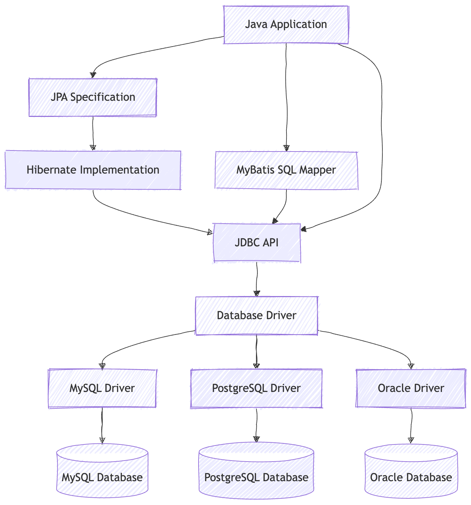

# Database Connection
JDBC is the low-level database access API; JPA is a standard; Hibernate is a common implementation of JPA; and MyBatis is a SQL mapping framework based on JDBC, but it focuses more on writing SQL manually.




| Technology  | What it is                       | What you mainly write                          |
| ----------- | -------------------------------- | ---------------------------------------------- |
| `JDBC`      | Native Java database access API  | SQL + `Connection` / `Statement` / `ResultSet` |
| `JPA`       | Java ORM standard specification  | `Entity`, `Repository`, `JPQL`                 |
| `Hibernate` | A concrete implementation of JPA | Usually used together with JPA                 |
| `MyBatis`   | SQL Mapper framework             | XML / annotation SQL + Mapper interfaces       |


## JDBC

JDBC is Java’s standard way to connect to databases: it uses DriverManager to find a database driver, creates a Connection, sends SQL through Statement or PreparedStatement, and reads query results through ResultSet.

Class.forName(...) loads the MySQL JDBC driver class.
When the class is loaded, the driver registers itself with DriverManager.
Then, when DriverManager.getConnection(...) is called,
DriverManager checks the registered drivers and finds the one that supports the jdbc:mysql URL.
Finally, it calls that driver to create and return a Connection object.

Class.forName is not required, SPI is supported, so we dont need to write Class.forName anymore


| Object              | Meaning                  | Role                                    |
| ------------------- | ------------------------ | --------------------------------------- |
| `DriverManager`     | Driver manager           | Finds the correct database driver       |
| `Connection`        | Database connection      | Represents a connection to the database |
| `Statement`         | SQL executor             | Sends SQL to the database               |
| `PreparedStatement` | Precompiled SQL executor | Safer and better for parameters         |
| `ResultSet`         | Query result             | Reads data returned by `SELECT`         |


DriverManager
│
│ getConnection()
▼
Connection
│
│ createStatement()
▼
Statement
│
│ executeQuery()
▼
ResultSet
- Connection = road to database
- Statement  = car running on the road
- ResultSet  = goods loaded by the car


```java
import java.sql.*;

public class JdbcExample {
    public static void main(String[] args) throws SQLException {
        String url = "jdbc:mysql://localhost:3306/test";
        String username = "root";
        String password = "123456";

        try (
            Connection connection = DriverManager.getConnection(url, username, password);
            PreparedStatement statement =
                    connection.prepareStatement("SELECT id, name FROM users WHERE id = ?");
        ) {
            statement.setInt(1, 1);

            try (ResultSet resultSet = statement.executeQuery()) {
                while (resultSet.next()) {
                    int id = resultSet.getInt("id");
                    String name = resultSet.getString("name");

                    System.out.println(id + " " + name);
                }
            }
        }
    }
}
```