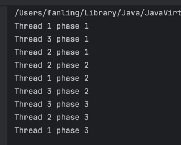

# CyclicBarrier
CyclicBarrier is a Java concurrency utility that lets a group of threads wait for each other at a common barrier point.
It is a reusable synchronization aid that allows a fixed number of threads to wait for each other at a common barrier point. When all participating threads call await(), the barrier is tripped, optional barrier action can run, and all threads continue to the next phase. It is useful for multi-phase parallel processing.

Package: `java.util.concurrent.CyclicBarrier`

##  Core idea
Suppose you have 3 threads doing phase 1 work, and none of them should start phase 2 until all 3 finish phase 1.

That is exactly what CyclicBarrier is for.

`CyclicBarrier barrier = new CyclicBarrier(3);`

Meaning:
- barrier size = 3 
- each thread calls await()
- when the 3rd thread arrives, all waiting threads are released together

## Main methods
1. CyclicBarrier(int parties)
Create a barrier with a fixed number of participating threads. code:
`CyclicBarrier barrier = new CyclicBarrier(3);`
2. CyclicBarrier(int parties, Runnable barrierAction)
You can also provide a task that runs when the last thread arrives. Code:
```
CyclicBarrier barrier = new CyclicBarrier(3, () -> {
    System.out.println("All parties arrived, moving to next phase");
});
```
This barrierAction is executed once per barrier trip.
3. await()
   Current thread waits until all parties arrive.When the required number of threads have called await(), they are all released. Code:
`barrier.await();`
4. await(timeout, unit)
   Wait with timeout. If timeout happens, the barrier may become broken. Code:
`barrier.getNumberWaiting();`
5. getParties()
   Returns the total number of parties. Code
`barrier.getParties();`
6. isBroken()
Checks whether the barrier is broken. Code:
   `barrier.isBroken();` 
Barrier can become broken if:
- one waiting thread is interrupted
- one thread times out
- barrier is reset
7. reset()
   Resets the barrier. Use carefully, because waiting threads may get exceptions. Code:
`barrier.reset();`

example:
```java
package org.lfan142.concurrency.codeexample;

import java.util.concurrent.CyclicBarrier;

public class CyclicBarrierDemo {

    public static void main(String[] args) {
        CyclicBarrier barrier = new CyclicBarrier(3);

        Runnable task = () -> {
            try {
                System.out.println(Thread.currentThread().getName() + " phase 1");
                barrier.await();

                System.out.println(Thread.currentThread().getName() + " phase 2");
                barrier.await();

                System.out.println(Thread.currentThread().getName() + " phase 3");
            } catch (Exception e) {
                e.printStackTrace();
            }
        };
        new Thread(task, "Thread 1").start();
        new Thread(task, "Thread 2").start();
        new Thread(task, "Thread 3").start();
    }
}

```

Meaning
- all 3 threads do phase 1 
- each calls await()
- when all 3 arrive, barrier opens 
- then they all do phase 2 
- barrier is reused again 
- then they continue

That is why it is called cyclic.

## Typical use cases
1. Multi-phase parallel computation
Example:
- several worker threads process chunks of data 
- after each phase, all threads must synchronize before next phase

2. Simulation / game rounds
Example:
   - all players/agents complete one round
   - then next round begins together
3. Parallel algorithms
   Example:
   - matrix computation 
   - iterative scientific computing 
   - staged processing

## Underlying implementation idea
CyclicBarrier is built using:
- a lock 
- a condition 
- a count of waiting threads 
- a “generation” concept to support reuse

Conceptually:
- each thread arrives and decreases remaining count 
- if not last, it waits on condition 
- last thread triggers barrier action, resets generation, signals all others 
- barrier becomes ready for next cycle

So compared with CountDownLatch, it is more like:

- shared rendezvous point 
- reusable phase gate

## When to choose CyclicBarrier

Use CyclicBarrier when:
- a fixed number of threads must repeatedly wait for each other
- work happens in phases
- all parties move forward together
Do not use it when:
- you only need one-time completion waiting → use CountDownLatch 
- you need dynamic number of parties or more flexible phase control → consider Phaser


