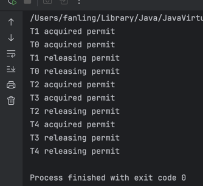

# Semaphore
Semaphore is a Java concurrency utility used to control how many threads can access a resource at the same time.
Semaphore is a synchronization aid that manages a set of permits and controls how many threads can access a resource concurrently. Threads call acquire() to obtain a permit and release() to return it. It is useful for limiting concurrency, throttling access, and protecting pools of limited resources.
- semaphore = permit counter 
- acquire() takes a permit 
- release() returns a permit 
- allows N threads at once 
- good for limiting resource usage

package: `java.util.concurrent.Semaphore`

## Core Idea
A semaphore has a number of permits.
- to enter, a thread must acquire a permit 
- when done, it must release the permit 
- if no permit is available, the thread waits
So it is like a gate with limited slots.

## Main methods
1. Semaphore(int permits)
   Create a semaphore with a fixed number of permits. Code:
`Semaphore semaphore = new Semaphore(3);`
2. acquire()
   Acquire one permit. If none is available, the thread blocks. code:
`semaphore.acquire();`
3. release()
   Return one permit. Code: 
`semaphore.release();`
4. tryAcquire()
   Try to get a permit immediately. Code:
```
if (semaphore.tryAcquire()) {
    try {
        // use resource
    } finally {
        semaphore.release();
    }
}
```
5. tryAcquire(timeout, unit)
   Wait up to a limited time. Code:
```
if (semaphore.tryAcquire(1, TimeUnit.SECONDS)) {
    try {
        // use resource
    } finally {
        semaphore.release();
    }
}
```
6. availablePermits()
   Check how many permits are left. Code:
`int n = semaphore.availablePermits();`

example:
```java
package org.lfan142.concurrency.codeexample;

import java.util.concurrent.Semaphore;

public class SemaphoreDemo {
    private static final Semaphore semaphore = new Semaphore(2);

    public static void main(String[] args) {
        Runnable task = () -> {
            try {
                semaphore.acquire();
                System.out.println(Thread.currentThread().getName()+ " acquired permit");
                Thread.sleep(200);
                System.out.println(Thread.currentThread().getName() + " releasing permit");
            } catch (InterruptedException e) {
                throw new RuntimeException(e);
            } finally {
                semaphore.release();
            }

        };
        for (int i = 0; i < 5; i++) {
            new Thread(task, "T" + i).start();
        }
    }
}

```


Meaning:
- only 2 threads can run inside the protected section at once
- others wait

## Typical use cases
1. Limit concurrent access to a resource
Examples:
- database connections 
- file handles 
- API request slots 
- printer / hardware access
2. Rate limiting/throttling
Example:
- only 10 tasks may run at once
3. Resource pool control
Even if many threads exist, only a fixed number can use scarce resources simultaneously.

## Semaphore vs Lock
Lock: A lock usually allows:
- only 1 thread at a time

Semaphore. A semaphore allows:
- N threads at a time
So:
- Lock = mutual exclusion 
- Semaphore = limited concurrency

If you create:
`new Semaphore(1)`
that behaves somewhat like a mutex. This is called a binary semaphore. It allows only one thread at a time.
But it is still different from ReentrantLock in behavior and ownership rules.

A Semaphore does not have the same ownership concept as a lock.
For example:
- one thread can acquire
- another thread can release
That is allowed with semaphore semantics.
But with a normal lock, the thread that unlocks should be the thread that locked it.
So semaphores are more about resource permits, not ownership-based critical sections

## Fair vs non-fair semaphore
You can create a fair semaphore:
`Semaphore semaphore = new Semaphore(3, true);`
Fair semaphore
- permits are granted roughly in FIFO order
Non-fair semaphore
- default 
- usually higher throughput 
- a later thread may sometimes get permit earlier

Same trade-off as fair locks:
- fairness helps prevent starvation 
- but may reduce throughput

## Multiple permits
A thread can acquire more than one permit:
`semaphore.acquire(2);`
and release more than one:
`semaphore.release(2);`
Useful when one task needs multiple resource units.

## Underlying idea
Semaphore is built on AQS (AbstractQueuedSynchronizer).
Conceptually:
- internal state = current number of permits
- acquire() tries to reduce that state
- if not enough permits, thread waits in queue 
- release() increases state and may wake waiting threads
So it is a shared synchronizer, not a monitor lock.

## JMM / memory semantics
Like other java.util.concurrent synchronizers, semaphore operations also provide coordination and visibility guarantees.
A useful interview-level point is:
Actions before release() happen-before actions after another thread successfully acquire()s that permit.
So semaphore is also a safe thread-coordination mechanism, not just a counter.

