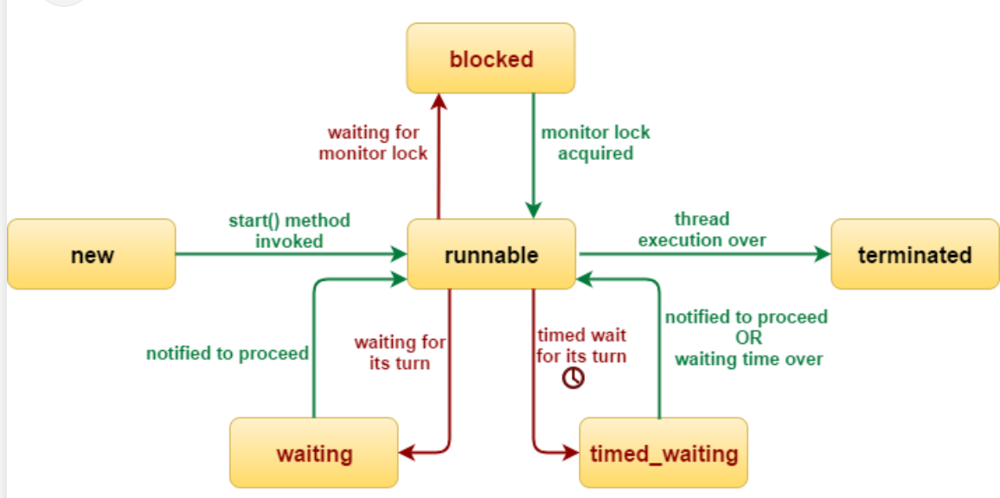

# Thread
In java, Thread.Sate has 6 states:
| State           | Meaning                                            |
| --------------- | -------------------------------------------------- |
| `NEW`           | thread object created, but not started yet         |
| `RUNNABLE`      | ready to run, or currently running on CPU          |
| `BLOCKED`       | waiting to acquire a monitor lock (`synchronized`) |
| `WAITING`       | waiting indefinitely for another thread’s action   |
| `TIMED_WAITING` | waiting for a limited time                         |
| `TERMINATED`    | execution finished                                 |

1. NEW 
The thread has been created, but start() has not been called yet.
```
Thread t = new Thread(()-> System.out.println("hello"));
System.out.println(t.getState()); //NEW
```
2. RUNNABLE
After `start()`, the thread enters RUNNABLE. Important point: 
In java, RUNNABLE includes both:
- actually running on CPU
- ready to run, waiting for CPU scheduling
so java does not have a separate "Running" state in Thread.State.

3. BLOCKED
The thread is waiting to enter a synchronized block or method because another thread already holds the monitor lock.
Example:
```
synchronized(lock){
    // another thread trying to enter here may become BLOCKED
}
```
This is specifically lock acquisition waiting for a monitor.

4. WAITING
The thread waits indefinitely until another thread wakes it or some event happens.
Common causes:
- Object.wait()
- Thread.join()
- LockSupport.park()
The current thread may enter WAITING until thread finishes.
5. TIME_WAITING
The thread waits for a specified amount of time. Common causes:
- Thread.sleep(1000)
- Object.wait(1000)
- Thread.join(1000)
6. TERMINATED
The thread has finishes execution.
Example:
- `run()` method completes normally
- or exits because of uncaught exception
### Thread lifecycle simple flow:
NEW -> RUNNABLE -> (BLOCKED / WAITING / TIMED_WAITING) -> RUNNABLE -> TERMINATED
A thread may move between
- RUNNABLE
- BLOCKED
- WAITING
- TIME_WAITING
until it finally becomes 'TERMINATED'


### Main methods of Thread
1) start()
Starts a new thread.
```
Thread t = new Thread(()->{
    System.out.println("running");
});
t.start();
```
- start() creates a new execution path
- it will call run() internally in a new thread
Do not call run() directly if you want a new thread
2) run()
Contains the task logic.
```java
class Mythread extends Thread {
    @Override
    public void run(){
        System.out.println("thread work");
    }
}
```
If call `t.run()` it is just a normal method call in the current thread, not a new thread.
3) sleep(long millis)
Pauses the current thread for a period of time.
- static method
- current thread sleeps
- does not release locks
- enters TIME_WAITING
4) join()
Waits for another thread to finish.
```
Thread t = new Thread(() -> {
    System.out.println("worker");
});
t.start();
t.join(); // current thread waits until t finishes
```
- current thread waits
- often enters WAITING
- join(timeout) leads to TIMED_WAITING
5) yield()
Hints to the scheduler that the current thread is willing to let other threads run.
Important:
- static method
- only a hint
- no strong guarantee
- rarely used in business code
6) interrupt()
Interrupts a thread.What it does depends on the target thread’s situation.
If thread is in:
- sleep()
- wait()
- join()
it usually throws InterruptedException. Otherwise, It sets the thread’s interrupt flag.
7) isInterrupted()
Checks whether a thread has been interrupted.
- instance method 
- checks interrupt flag 
- does not clear the flag
8) interrupted()
Static method that checks current thread’s interrupt status and clears it. Important difference:
- isInterrupted() → does not clear
- interrupted() → clears the current thread’s interrupt flag
This is a common interview question.
9) currentThread()
Returns the currently executing thread.
Useful for:
- logging 
- debugging 
- thread-specific handling
10) getName()/setName()
Get or set thread name.
Thread.currentThread().getName();
t.setName("worker-1");
Useful for:
- logs 
- debugging 
- monitoring
11) getState()
Gets current thread state.
System.out.println(t.getState());
Useful for debugging, but usually not for core business logic.
12) isAlive()
Checks whether the thread has started and not yet terminated.Returns true if thread is still running or not finished yet.
13) setDaemon(boolean)/isDaemon()
Marks a thread as daemon or checks whether it is daemon.
t.setDaemon(true);
Important:
- must call before start()
- daemon threads are background threads 
- JVM can exit if only daemon threads remain

Examples:
- GC threads are daemon threads

## wait() & sleep()
wait() is a method of `Object` rather than `Thread` because it is not simply about pause a thread.
It is part of Java's monitor-based coordination model. A thread calls wait()
 while holding a specific object's monitor, and `wait()` releases that monitor and places the thread into the object's wait
set. Later, another thread call `notify()` or `notifyAll()` on the same object to wake waiting threads.
So wait/notify are tied to object monitors and shared-condition coordination, not to thread sleeping or lifecycle control.
- sleep() = thread pause
- wait() = object condition wait 

wait() must be called inside synchronized. Because `wait()` does two things:
- releases the current object's monitor
- puts the current thread into that object's wait set
If the thread does not already hold that object's monitor, it has nothing to release. so this code is illegal:
```
Object lock = new Object();
lock.wait();
```
It throws 'IllegalMonitorStateException', because the current thread is not inside: synchronized, and therefore does not 
own lock's monitor.

### what is wait() really wait for?
wait() is not mainly about time. It is about waiting until some shared condition becomes true.
A classic example is producer-consumer.
- if the queue is empty, the consumer must wait
- if the queue is full, the producer must wait.
Example:
```java
class MessageBox {
    
    private String message;
    private boolean hasMessage = false;
    public synchronized void put(String message){
        while(hasMessage){
            wait();
        }
        hasMessage = true;
        this.message = message;
        notifyAll();
    }
    
    public synchronized String take(){
        while(!hasMessage){
            wait();
        }
        hasMessage = false;
        notifyAll();
        return message;
    }
}
```
Here:
- wait() means "the condition is not satisfied yet"
- notifyAll() means "the condition may have changed, wake up and check again"
So wait() is an object-based condition waiting mechanism.

### Why can't sleep() replace wait()?
Because their meanings are completely different.
sleep()
- pauses the current thread for some time
- does not release locks
- wakes up automatically when time is over
- does not care whether a shared condition changed

wait()
- wait for a condition
- releases the lock
- needs notify()/notifyAll() or interruption/timeout
- after wakeup, must re-acquire the lock before continuing.

So if you use `sleep()` inside a synchronized block:
```
synchronized(lock) {
    Thread.sleep(5000); //wrong one.
}

```
then for 5 seconds:
- the threads is not doing useful work
- but it still holds the lock
- other threads cannot enter and change the shared state

