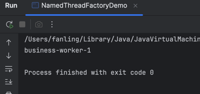

# ThreadFactory
`ThreadFactory` in Java is an interface used to customize how threads are created.
Package:
```
java.util.concurrent.ThreadFactory
```
Interface:
```
public interface ThreadFactory {
    Thread newThread(Runnable r);
}
```
## Core Idea
When a thread pool needs a new worker thread, it does not have to call `new Thread(...)` directly. Instead, it can use a `ThreadFactory` to decide:
- thread name
- daemon or non-daemon
- priority
- thread group
- uncaught exception handler
- custom thread class if needed

So a good one-line definition is:
`ThreadFactory` is a pluggable strategy for creating threads in a controlled and consistent way.

## Why it is useful
Without a custom `ThreadFactory`, threads created by executors often have generic names like:
- pool-1-thread-1
- pool-1-thread-2
That works, but in production systems you often want better control.

## Common reasons to use it

1. Better thread names
Helpful for:
- logs
- thread dumps
- monitoring
- debugging
Example:
- `order-service-worker-1`
- `payment-io-3`
2. Set daemon threads: may want some background threads to be daemon threads.
3. Set uncaught exception handler: If a thread crashes, you may want to log in clearly.
4. Standardize thread creation: Instead of each pool creating threads differently, you apply one policy.

## Simple Example
Custom thread factory
Use with thread pool

```java
package org.lfan142.concurrency.codeexample;

import java.util.concurrent.ThreadFactory;
import java.util.concurrent.atomic.AtomicInteger;

public class NamedThreadFactory implements ThreadFactory {

    private final String prefix;
    private final AtomicInteger count = new AtomicInteger(1);

    public NamedThreadFactory(String prefix){
        this.prefix = prefix;
    }

    @Override
    public Thread newThread(Runnable r) {
        Thread t = new Thread(r);
        t.setName(prefix + "-" + count.getAndIncrement());
        return t;
    }
}
```

```java
package org.lfan142.concurrency.codeexample;

import java.util.concurrent.ArrayBlockingQueue;
import java.util.concurrent.ExecutorService;
import java.util.concurrent.ThreadPoolExecutor;
import java.util.concurrent.TimeUnit;

public class NamedThreadFactoryDemo {

    public static void main(String[] args) {
        ExecutorService executorService = new ThreadPoolExecutor(
                2, //the number of threads to keep in the pool, even if they are idle, unless allowCoreThreadTimeOut is set
                2, //the maximum number of threads to allow in the pool
                0L, // when the number of threads is greater than the core, this is the maximum time that excess idle threads will wait for new tasks before terminating.
                TimeUnit.MILLISECONDS, //the time unit for the keepAliveTime argument
                new ArrayBlockingQueue<>(10), // the queue to use for holding tasks before they are executed. This queue will hold only the Runnable tasks submitted by the execute method.
                new NamedThreadFactory("business-worker")

        );

        executorService.submit(()-> {
            System.out.println(Thread.currentThread().getName());
        });
        executorService.shutdown();
    }
}

```




## Typical usage with `ThreadPoolExecutor`

`ThreadFactory` is commonly passed into:
`new ThreadPoolExecutor(...)`
Constructor form includes:
```
ThreadPoolExecutor(
      corePoolSize,
      maximumPoolSize,
      keepAliveTime,
      unit,
      workQueue,
      threadFactory,
      handler  
)
```
So it becomes part of thread pool design

## More complete example
```java
package org.lfan142.concurrency.codeexample;

import java.util.concurrent.ThreadFactory;
import java.util.concurrent.atomic.AtomicInteger;

public class CustomThreadFactory implements ThreadFactory {

    private final String prefix;
    private final boolean daemon;
    private final AtomicInteger threadNumber = new AtomicInteger(1);

    public CustomThreadFactory(String prefix, boolean daemon){
        this.prefix = prefix;
        this.daemon = daemon;
    }

    @Override
    public Thread newThread(Runnable r) {
        Thread t = new Thread(r);
        t.setName(prefix + "-" + threadNumber.getAndIncrement());
        t.setDaemon(daemon);
        t.setUncaughtExceptionHandler((thread, ex) ->{
            System.out.println("Thread " + thread.getName() + " failed: " + ex.getMessage());
        });
        return t;
    }
}

```
This factory customizes:
- name
- daemon flag
- uncaught exception handling

Java provides a default one through `Executors`:
`Executors.defaultThreadFactory()`
It creates normal non-daemon threads with standard naming.
If do not care about customization, that is often enough. But in production systems, custom naming is usually a good idea.
- `ThreadPoolExecutor` : thread pool behavior
- `ThreadFactory`: thread creation policy

## Good production practices
1. Use custom names: very useful in logs and thread dumps.
2. Keep thread settings predictable. Examples:
   - daemon or not
   - uncaught exception policy
3. Do not put business logic in the factory: It should only create/config threads.
4. Reuse one factory per executor type. Example:
   - order-service-async
   - payment-io
   - scheduler

With ThreadPoolTaskExecutor, behavior is roughly:
- If running threads < corePoolSize → create new thread 
- Else if queue not full → enqueue task 
- Else if running threads < maxPoolSize → create more threads 
- Else → reject task
So queueCapacity has a big effect on pool behavior.

Best practices in Spring Boot microservices
1. Use a shared bounded business executor: Usually better than creating threads directly in service code.
2. Name threads clearly. For example:
   - order-async- 
   - payment-io- 
   - scheduler-
3. Keep it bounded: Do not use unbounded queue casually.
4. Separate scheduler and business async executor: Do not mix @Scheduled jobs and user-facing async business tasks unless you intentionally want that.
5. Tune based on workload
   - CPU-bound: Smaller pool 
   - Blocking I/O: Larger but still bounded pool

## Common mistakes
1. Forgetting @EnableAsync, Then @Async does not work.
2. Calling @Async method inside same class.This often does not go through the Spring proxy, so async may not happen.
Example:
   - method A in same bean calls method B annotated with @Async 
   - B may execute synchronously
This is a classic Spring interview pitfall.
3. Using one giant pool for unrelated workloads: Can cause interference.
4. Huge queue with small core pool: May create high latency while pool never expands much.
5. Not handling rejection policy: Then overload behavior becomes unclear.