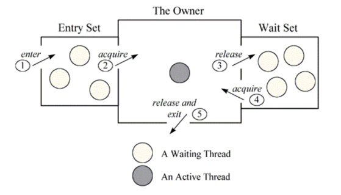

# Java Object Monitor
A java object monitor is a synchronization mechanism that every Java Object(except value types and records) 
inherently possesses to control concurrent access by multiple threads.
It ensures data integrity in multi-thread environments by providing both mutual exclusion
and thread coordination.
## Mutual exclusion
A monitor is like a building that contains one special room that can be occupied by only one thread at a time.
The room usually contains some data. From the time a thread enters this room to the time it leaves, it has exclusive access
to any data in the room. Entering the monitor building is called "entering the monitor". 
Entering the special room insie the building is called "acquire the monitor". Occupying the room is called
"owning the monitor" and leaving the room is called "releasing the monitor". 
Leaving the entire building is called "exiting the monitor"
When a thread arrives to access protected data (enter the special room), it is first put in queue in building reception (entry-set). If no other thread is waiting (own the monitor), the thread acquires the lock and continues executing the protected code. When the thread finishes execution, it release the lock and exits the building (exiting the monitor).
If when a thread arrives and another thread is already owning the monitor, it must wait in reception queue (entry-set). When the current owner exits the monitor, the newly arrived thread must compete with any other threads also waiting in the entry-set. Only one thread will win the competition and own the lock.
There is no role of wait-set feature.

## Cooperation
In general, mutual exclusion is important only when multiple threads are sharing data or some other resource. If two threads are not working with any common data or resource, they usually can’t interfere with each other and needn’t execute in a mutually exclusive way. Whereas mutual exclusion helps keep threads from interfering with one another while sharing data, cooperation helps threads to work together towards some common goal.
Cooperation is important when one thread needs some data to be in a particular state and another thread is responsible for getting the data into that state e.g. producer/consumer problem where read thread needs the buffer to be in a “not empty” state before it can read any data out of the buffer. If the read thread discovers that the buffer is empty, it must wait. The write thread is responsible for filling the buffer with data. Once the write thread has done some more writing, the read thread can do some more reading. It is also sometimes called a “Wait and Notify” OR “Signal and Continue” monitor because it retains ownership of the monitor and continues executing the monitor region (the continue) if needed. At some later time, the notifying thread releases the monitor and a waiting thread is resurrected to own the lock.
This cooperation requires both i.e. entry-set and wait-set. Below given diagram will help you in understand this cooperation.

https://howtodoinjava.com/java/multi-threading/multithreading-difference-between-lock-and-monitor/