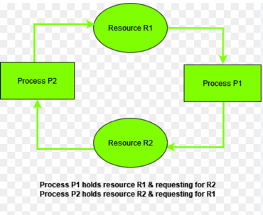

# Problems caused by multithreading
problem types
- Correctness issues
  - race condition
  - visibility issue
  - ordering issue
  - atomicity violation
  - inconsistent state
  - unsafe publication
- Progress issues
  - deadlock
  - livelock
  - starvation
- Performance/Operational issues
  - contention
  - resource exhaustion
  - scheduling problems

## The physical model underneath multithreading
### 1. Threads run on different CPU cores
When two Java threads run concurrently, they may run on:
- different CPU cores
- at different times on the same core
- with different cached views of memory
So there is no signle global "immediately visible" memory view unless synchronization establish it.
### 2. CPUs use caches, not main memory every time
This is the root of many visibility problems. A core does not read RAM(Random Access Memory, it's the computer's main working memory whre 
programs and data are stored while they are running) for every variable access. It uses:
- registers
- L1/L2/L3 caches
- store buffers
- cache coherence protocols
That means:
- Thread A may update a variable
- Thread B may still see the old value for a while
- unless java-level synchronization forces visibility

### 3. Modern CPUs and compilers reorder operations
This is the root of ordering problems. For performance, the JVM JIT and CPU may reorder instructions as long as single-thread semantics stay correct.
But in multithread code, another thread may observe:
- writes becoming visible in a different order
- reads seeing stale values
- partially updated state
### 4. "Simple" Java operations are often multiple machine steps
This is the root of atomicity violations and many race conditions.
For example:
```
count++;
```
is not one indivisible hardware action in general. It is roughly:
- load from memory/cache
- increment in register
- store back
Tf another thread interleaves between those steps, correctness breaks.
### 5. Threads are scheduled by the OS/JVM runtime
Threads do not run continuously in a perfectly fair way. The scheduler decides:
- when a thread runs
- when it is paused
- when another thread gets CPU
- how lock waiters are resumed
This is the root cause of:
- starvation
- scheduling unfairness
**- lock convoying
- latency spikes**
### 6. Synchronization is not magic; it creates memory barriers and coordination
At a low level, synchronization mechanisms such as:
- synchronized
- volatile
- Lock
- atomics/CAS
work by creating rules around:
- memory visibility
- ordering
- mutual exclusion
- CPU cache synchronization
- lock ownship
These rules cost something, but they create correctness

## Multithreading problems
### Race condition
root cause: a race condition happens because multiple threads access shared mutable state, and the final outcome depends on timing
 of execution, causing unpredictable or incorrect behavior.
At the physical level:
- each thread may run on a different core
- each core may cache values
- operations like read-modify-write are not automatically indivisible.
- interleaving vary from run to run

Detailed example.
```java
class Counter {
    int count = 0;
    
    void increment (){
        count ++;
    }
}
```
two threads call `increment()`, what may happen internally:
Thread A:
- load `count` as 0 into register
- add 1
- not yet write back
Thread B:
- load `count` also sees 0
- add 1
- write 1
Thread A: 
- write 1
Final result is 1, not 2.
Wy this happens physically? Because the CPU does not "understand" your business meaning of increment.
it just executes multiple machine-level steps. Without a lock or atomic primitive, two threads can overlap.
### Fixes:
Fix 1: `synchronized`
```java
class Counter {
    private int count = 0;
    synchronized void increment(){ 
        count ++;
    }
}
```
why it works:
- only one thread enters the critical section at a time
- monitor enter/exit also establishes visibility and ordering guarantees
Fix 2: `AtomicInteger`
```java
import java.util.concurrent.atomic.AtomicInteger;

class Counter{
    private final AtomicInteger count = AtomicInteger(0);
    
    void increment(){
        count.incrementAndGet();
    }
}
```
why it works:
- implemented with hardware-supported atomic primitives like compare-and-set
- avoids lost updates without a full heavyweight lock in simple cases

Fix 3: remove shared mutable state
Use message passing, queues, immutable data, or per-thread counters merged later.

### Visibility problem
One thread writes a value, but another thread does not see it promptly or reliably. At the physical level:
- writes may stay in store buffers or caches briefly
- another core may still read an older cached value
- without a happens-before relation, Java does not guarantee immediate visibility.
#### Detailed example
```java
class Worker {
    boolean stopped = false;
    
    void run() {
        while(!stopped) {
            //do something
        }
    }
    
    
    void stop(){
        stopped = true;
    }
}
```
we expect `run()` to stop after `stop()` is called. But the worker thread may keep seeing false. Why this happens physically
The worker thread may:
- keep `stopped` effectively cached
- have the loop optimized aggressively
- observe memory without a synchronization edge forcing refresh
#### how to fix
1. volatile
why use volatile works
- `volatile` writes are flushed with visibility guarantees
- `volatile` reads must observe a coherent value according to JMM rules
```java
class Worker {
    volatile boolean stopped = false;
    
    public void run(){
        while (!stopped){
            //do something
        }
    }
    
    public void stop(){
        this.stopped = true;
    }
}
```
2. synchronized
If both read and write are inside synchronized blocks on the same monitor, visibility is guaranteed 
3. use blocking coordination
Examples:
- Blocking Queue
- CountDownLatch
- Future
- Semaphore
These are often better than hand-rolled flags.

### Ordering/reordering problem
Operations may be observed in a different order than written. The root cause at physical level:
- CPU reorder memory operations
- compilers reorder instructions
- JVM JIT reorders when legal
- store buffers can make writes visible at different times

Detailed example
```java
class Holder {
    int value = 0;
    boolean ready = false;
    
    void publish() {
        value = 42;
        ready = true;
    }
    
    void consume() {
        if(ready){
          System.out.println(value);
        }
    }
}
```

we expect:
- if `ready` is true, `value` must be 42;
But another thread may observe:
- ready == true
- value == 0
Why this happens?
Because without synchronization:
- there is no guarantee the observing thread sees the writes in source-code order
- one write may become visible before the other
Fixes:
1. volatile ready
JMM guarantees writes before a volatile write become visible to a thread that later sees the volatile read
```java
class Holder {
    int value = 0;
    volatile boolean ready = false;
    
    void publish() {
        value = 42;
        ready = true;
    }
    
    void consume(){
        if(ready){
          System.out.println(value);
        }
    }
}
```
2. synchronize publication and read
3. safe publication with immutable object
This often cleaner than coordinating multiple mutable fields.
```java
class Data {
    final int value; //immutable
    
    Data(int value){
        this.value = value;
    }
}

class Holder {
    private volatile Data data;
    
    void publish(){
        data = new Data(42);
    }
}
```

### Atomicity violation
A logically single action is implemented as multiple steps, and another thread can observe or 
modify state in the middle.
At physical level:
- multiple memory reads/writes happen
- thread scheduling can switch between those steps
- cache and visibility make interleaving even trickier
Detailed example
```java
class Amount {
    
    int balance = 100;
    
    void withdraw(int amount) {
         if(balance >= withdraw){
             balance -= withdraw;
         }
    }
}
```
If two threads both try to withdraw 80. Possible execution:
- Thread A reads balance = 100
- Thread B reads balance = 100
- both pass the check
- both subtract 80
Final balance becomes -60 or another inconsistent state. This is because check and update are not one 
indivisible transaction. Another thread can slip in between.
Fixes:
1. synchronize the whole compound action
```java
class Account {
    private int balance = 100;
    
    synchronized void withdraw(int amount){
        if(balance >= amount){
            balance -= amount;
        }
    }
}
```
2. use CAS-based loop for simple state
Sometimes atomics work, but only if the invariant is simple enough.
3. isolate ownership
Only one thread owns the balance and processes queued requests. That avoids shared mutation entirely.

### Inconsistent shared state/broken invariants
Multiple related fields should change together, but other threads can observe them half-updated. At the physical level:
- different fields are separate memory writes
- different writes can become visible at different times
- another thread can read between them

Detailed example:
```java
class Range{
    int lower;
    int upper; //invariant: lower <= upper
}
```
one thread does:
```
lower = 10;
upper = 20;
```
Another thread might observe:
```
lower = 10;
upper = 5;
```
If the updates are not coordinated or other writes are happening. Because there is no atomic "update both fields as unit."
Fixes:
1. synchronize updates and reads together
```java
class Range{
    private int lower;
    private int upper;
    
    synchronized void setRange(int l, int u){
        if(l > u) 
            throw new IllegalArgumentException();
        lower = l;
        upper = u;
    }
    
    synchronized int[] snapshot(){
        return new int[]{lower, upper};
    }
}
```
2. replace mutable multiple fields with one immutable object
```java
record RangeValue(int lower, int upper){}

class RangeHolder{
    private volatile RangeValue range = new RangeValue(0, 0);
    
    void setRange(int l, int u){
        if(l > u)
            throw new IllegalArgumentException();
        range = new RangeValue(l, u);
    }
    
    Range getRange(){
        return range;
    }
}
```

### Unsafe Publication
A reference to an object becomes visible before the object is safely published. At the physical level:
- object construction is not just "one thing"
- memory allocation, field writes, and reference assignment may be observed in problematic way without synchronization
- another thread may see a reference before seeing a fully initialized state
Detailed example:
```java
class Config {
    String host;
    int port;
    
    Config(){
        host = "localhost";
        port = 8080;
    }
}


class Holder {
    static Config config;
    
    static void init(){
        config = new Config();
    }
}
```
Another thread reads config with no synchronization. In bad coordinated publication patterns, it may observe 
a partially initialized object. Because "publish reference" and "finish initialization" need ordering and visibility guarantee.

Fixes:
1. final fields + safe publication
```java
class Config {
    final String host;
    final int port;
    
    Config(){
        host = "localhost";
        port = 8080;
    }
}
```
Then publish safely:
- static initialization
- volatile field
- synchronized block
- concurrent container
2. static initializer
```java
import javax.security.auth.login.Configuration;

class Holder {
  static final Config config = new Config();
}
```
Class initialization is thread-safe in Java

3. volatile reference
```java
class Holder{
    private volatile Config config;
    
    void init(){
        config = new Config();
    }
}
```

### Deadlock
Two or more threads wait forever on locks in a cycle. At implementation level:
- each thread owns one monitor/lock
- each blocks waiting for another
- no one can progress to release what the other needs.
Detailed example:
```java
class TransferService {
    private final Object lockA = new Object();
    private final Object lockB = new Object();
    
    void t1(){
        synchronized (lockA){
            synchronized(lockB){
                //do something
            }
        }
    }
    
    void t2(){
        synchronized(lockB){
            synchronized (lockA){
                //do something
            }
        }
    }
}
```
If Thread 1 enters t1() and Thread 2 enters t2():
- T1 holds lockA, waits for lockB
- T2 holds lockB, waits for lockA
then deadlock. Locks are mutually exclusive resources. The wait graph contains a cycle.
Fixes:
1. global lock ordering
Always acquire locks in the same order
2. reduce nested locking
Fewer locks means fewer cycles.
3. `tryLock` with timeout/backoff

```java
import java.util.concurrent.locks.ReentrantLock;

ReentrantLock lock1 = new ReentrantLock();
ReentrantLock lock2 = new ReentrantLock();
```
with timed acquisition, a thread can back off instead of waiting forever.
4. redesign to avoid multiple lock ownership
Actor/message-passing models help here.

### Livelock
Threads are active and not blocked, but their coordination logic keeps preventing progress.
example:

At physical level:
- they keep getting CPU
- keep reacting
- keep retrying or backing off in sync
- useful state never advances

Detailed example
Imagine two threads both doing:
- try to acquire resource
- if fail, release current and retry immediately
If both use identical behavior, they can continuously collide.
Unlike deadlock, the threads are not sleeping forever. They are spinning, retrying, or yielding in a 
synchronized bad pattern.
Fixes:
1. random backoff
Introduce jitter so both threads stop behaving identically.
2. bounded retries
After N failures, escalate or serialize the path.
3. deterministic ownership
Pick a leader or define an ordering so one side always yields.


### Starvation
A thread is repeatedly deinied access to CPU time, a lock, or another shared resource.
At the OS/scheduler level:
- unfair shceduling
- unfair lock acquisition
- long-running threads dominating
- queue ordering that permanently disadvantages some tasks
Detailed example
A non-fair lock is heavily contested. One unlucky thread keeps losing. Or one low-priority 
worker never gets enough CPU. This happens because schedulers and lock implementations
optimize throughput, not always fairness.
Fixes:
1. fair locks when necessary
```
new ReentrantLock(true) //true for fair lock
```
This improves fairness, though often with lower throughput.
2. shorten critical sections
   The less time a lock is held, the less starvation pressure.
3. better pool/queue design
 Avoid hot threds monopolizing resources.
4. separate workloads
Do not let long CPU-bound work stare latency-sensitive tasks in the same pool.

### Contention
Many threads fight over the same resource:
- same lock
- same atomic variable
- same queue
- same cache line
- same DB connection pool
At the physical level:
- cores invalidation each other's cache lines.
- lock acquisition forces coordination
- more time is spent waiting or synchronizing than doing useful work
Detailed Example:
```
AtomicLong counter = new AtomicLong();
```
Hundreds of threads call:
```
counter.incrementAndGet();
```
This may still become a hotspot, because they all contend on one shared memory location.
why it happens physically? Each update to the same variable can force cache coherence traffic between 
cores. That shared cache line bounces around.
Fixes:
1. `LongAdder`
```
LongAddr adder = new LongAdder();
adder.increment();
```
why it works:
- spreads updates across multiple internal cells.
- reduces a single hot contention point.
2. sharding/striping
Partition state across multiple locks or buckets
3. reduce lock scope
4. replace global state with per-thread/per-partition state

### Resource exhaustion
The system creates or retains more resources than it can sustain. At the physical/OS level:
- each thread needs stack memory and native metadata
- each socket/file/DB connection consumes kernel and JVM resources
- unbounded queues consume heap
- too many runnable threads create scheduler overhead

Detailed example
A server creates a new platform thread per request under large load. Eventually:
- native thread creation fails
- memory pressure rises
- DB pool saturates
- request queue explodes

why this happens physically
resource are finite:
- RAM
- CPU
- file descriptors
- native threads
- network connections
Fixes:
1. bounded thread pools
2. bounded queues
3. backpressure/rejection policy
4. tune connection pools
5. close resources correctly
6. use virtual threads for IO-heavy task when appropriate, but still control downstream bottlenecks

### Scheduling problems
Even correct code may behave badly because thread scheduling under load is unpredicted.
At the OS level:
- threads get time slices
- runnable threads compete
- context switches cost CPU
- CPU-bound and IO-bound tasks interfere
Detailed example
one executor handles:
- long CPU-heavy jobs
- short latency-sensitive tasks
The long tasks wait behind long tasks and system latency becomes unstable.
Schedulers are not aware of your business priority model unless you design for it.
Fixes:
1. separate executors by workload type
- CPU-BOUND POOL
- IO-bound pool
- scheduled tasks separately
2. limit active concurrency
3. avoid blocking inside CPU pools
4. measure queueing delay, not just code execution time.


## How the java tools map to the physical problems
### volatile
Gives:
- visibility
- ordering around volatile reads/writes
Does not give:
- general atomicity for compound actions
Best for:
- flags
- publication edges
- simple state transitions

### synchronized
Gives:
- mutual exclusion
- visibility
- ordering
Best for:
- compound updates
- protecting invariants
- simple monitor-based coordination
Trade-off:
- lock contention can hurt throughput

### Lock/ReentrantLock
Gives:
- mutual exclusion
- visibility
- advanced features like fairness, tryLock, interruptible waiting
Best for: when monitor features are not enough

### Atomic classes
Best for:
- single-variable lock-free operations
- counters
- CAS-based state transitions
Trade-off
- easy to misuse for multi-variable invariants

### Immutable objects
best for:
- safe sharing
- publication
- avoiding races entirely
This is often the highest-quality fix.

Multithreading problems come from the fact that:
- CPUs cache and reorder 
- simple operations are not automatically atomic 
- threads interleave unpredictably 
- schedulers are not perfectly fair 
- shared resources become bottlenecks
Java solves these with JMM guarantees and synchronization primitives, but the best engineering fix is often to reduce shared mutable state and simplify ownership.


| Issue                                     | Physical root cause                                                                                                     | Java symptom                                                             | Example                                                                     | Best fixes                                                                            | Preferred senior design choice                                                                      |
| ----------------------------------------- | ----------------------------------------------------------------------------------------------------------------------- | ------------------------------------------------------------------------ | --------------------------------------------------------------------------- | ------------------------------------------------------------------------------------- | --------------------------------------------------------------------------------------------------- |
| **Race condition**                        | Multiple threads interleave read/modify/write on shared data; operations are not inherently atomic                      | Wrong results, lost updates, intermittent bugs                           | Two threads both do `count++`, final value is too small                     | `synchronized`, `Lock`, `AtomicInteger`, concurrent structures                        | Remove shared mutable state; use ownership, immutable messages, queues                              |
| **Visibility issue**                      | One thread’s write stays in cache/register/store buffer and is not guaranteed visible to another without happens-before | Thread never sees updated flag/value; stale reads                        | stop flag updated, worker never stops                                       | `volatile` for simple flags, `synchronized`, `Lock`, coordination utilities           | Prefer higher-level coordination like `Future`, `BlockingQueue`, `CountDownLatch` over manual flags |
| **Ordering / reordering issue**           | CPU/JIT/compiler reorder operations; other thread can observe writes in unexpected sequence                             | “Ready” is true but data is still old/uninitialized                      | `value = 42; ready = true;` consumer sees `ready == true` and `value == 0`  | `volatile`, `synchronized`, safe publication, final fields                            | Publish immutable fully-constructed objects instead of multiple mutable fields                      |
| **Atomicity violation**                   | A logical single action is actually several machine/JVM steps; another thread slips in between                          | Check-then-act or read-modify-write breaks correctness                   | `if(balance>=amount) balance -= amount;` two threads both pass the check    | Synchronize the whole compound action, lock, CAS loop if simple enough                | Centralize state ownership or serialize mutation through one thread/component                       |
| **Inconsistent state / broken invariant** | Related fields are updated separately; another thread reads halfway through                                             | Impossible combinations of field values                                  | `lower` and `upper` seen as `lower > upper`                                 | Synchronize reads and writes together; replace multiple fields atomically             | Use immutable aggregate objects and replace whole snapshots                                         |
| **Unsafe publication**                    | Reference escapes before object is safely published; initialization and visibility are not coordinated                  | Partially initialized object seen by another thread                      | Shared config object read before fully visible                              | `final` fields, `volatile` reference, `synchronized`, static initialization           | Prefer immutable objects + safe publication via constructor + final fields                          |
| **Deadlock**                              | Threads hold locks in a cycle; each waits for the next lock forever                                                     | Program appears frozen; blocked threads in thread dump                   | T1 holds A waits for B, T2 holds B waits for A                              | Global lock ordering, avoid nested locks, `tryLock` with timeout, redesign            | Reduce lock count; prefer message passing / partitioned ownership                                   |
| **Livelock**                              | Threads keep reacting/retrying in sync, but no one makes forward progress                                               | High activity, no completion                                             | Two threads repeatedly back off and retry at same time                      | Randomized backoff, bounded retries, deterministic winner strategy                    | Use clearer ownership or queue-based coordination instead of symmetric retry loops                  |
| **Starvation**                            | Unfair scheduling or lock acquisition repeatedly denies one thread progress                                             | Some tasks never finish, one thread waits “forever”                      | One thread always loses lock competition                                    | Fair locks when necessary, shorter critical sections, workload balancing              | Design for bounded work and fair resource allocation; separate latency-sensitive work               |
| **Contention**                            | Too many threads fight over one lock, atomic variable, queue, or cache line                                             | Throughput drops, latency spikes, blocked/waiting threads                | Many threads update one global counter/lock                                 | Reduce lock scope, sharding, striping, `LongAdder`, concurrent collections            | Partition hot state; avoid single global bottlenecks                                                |
| **Resource exhaustion**                   | Too many threads/tasks/connections/queues consume finite OS/JVM resources                                               | OOM, “unable to create new native thread”, saturated pools               | Unbounded thread-per-request or unbounded task queue                        | Bounded pools, bounded queues, backpressure, rate limiting, correct resource closing  | Design explicit limits; make overload behavior intentional                                          |
| **Scheduling problems**                   | OS/JVM scheduler time-slices work unpredictably; CPU-bound and blocking work interfere                                  | Jitter, poor responsiveness, priority inversion-like behavior            | Long CPU jobs delay short requests in same executor                         | Separate executors, size pools correctly, reduce blocking, measure queue time         | Model workloads explicitly: CPU-bound, IO-bound, scheduled, latency-sensitive                       |
| **Thread interference on collections**    | Unsynchronized concurrent modification of non-thread-safe structures corrupts logical behavior                          | `ConcurrentModificationException`, lost elements, inconsistent iteration | Modify `ArrayList` while iterating from another thread                      | Use concurrent collections, external synchronization, iterator’s own `remove()`       | Choose collection by access pattern: `ConcurrentHashMap`, `CopyOnWriteArrayList`, `BlockingQueue`   |
| **False sharing**                         | Different variables used by different threads land on same CPU cache line; cache coherence causes ping-pong             | Unexpected slowdown even though threads touch different variables        | Per-thread counters stored adjacently still contend badly                   | Padding, structure layout changes, striped adders like `LongAdder`                    | Partition data with cache locality in mind for very hot paths                                       |
| **Priority inversion**                    | Low-priority thread holds resource needed by high-priority thread while medium-priority work keeps running              | High-priority work delayed unexpectedly                                  | Low-priority thread holds lock for logging/config while critical task waits | Reduce lock hold time, avoid priority-sensitive shared locks, protocol/design changes | Avoid depending on thread priorities for correctness                                                |


Correctness problems
- Race condition 
- Visibility issue 
- Ordering issue 
- Atomicity violation 
- Inconsistent state 
- Unsafe publication 
- Thread interference on collections

Progress problems
- Deadlock 
- Livelock 
- Starvation 

Performance / scalability problems
- Contention 
- False sharing 
- Scheduling problems 
- Resource exhaustion 
- Priority inversion

Fast memory aid
- Wrong result → think atomicity / visibility / ordering / race
- No progress → think deadlock / livelock / starvation
- Too slow under load → think contention / false sharing / scheduling / resource exhaustion

## rule of thumb
- The best fix is often not “add more locks.”
- Usually the strongest fixes are:
  - reduce shared mutable state 
  - use immutable snapshots 
  - assign ownership to one thread/component 
  - use queues for coordination 
  - partition hot state 
  - set explicit limits for concurrency and backlog