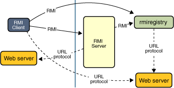

# Remote

In Java, Remote usually refers to:
- java.rmi.Remote
It is a marker interface usd in RMI (Remove Method Invocation)


## What it means
If a class implements Remote, it means:
- its methods can be called from another JVM, possibly on another machine.
So it is used for remote service objects, not ordinary local object.

## Why it is a marker interface
Remote itself has no methods:
```java
public interface Remote {
}
```
It only marks a type as being suitable for remote invocation. E.G.
- remote interface
```java
import java.rmi.Remote;
import java.rmi.RemoteException;

public interface HelloService extends Remote {
    String sayHello() throws RemoteException;
}
```
- Implementation
```java
import java.rmi.RemoteException;

public class HelloServiceImpl implements HelloService{

 protected HelloServiceImpl() throws RemoteException{
  super();
 }

 @Override
 public String sayHello() throws RemoteException {
  return "Hello from remote Server";
 }
}
```

## Important rules
A remote interface usually must
- extend Remote
- have remote methods that declare throw RemoteException
Example.
```java
String sayHello() throws RemoteException;
```
Why? Because remote calls can be fail due to:
- network issues
- server unavailable
- serialization problems
- communication timeout
## What is special about remote calls
A normal local method call is:
- same JVM
- same process memory
- fast and direct
A remote method call is:
- across JVMs or machines
- involves network communication
- may serialize parameters and return values
- can fail for network reasons.
So java forces remote methods to handle RemoteException.

## interview ready answer
java.rmi.Remote is a marker interface used in java RMI. A remote service interface extends Remote
to indicate that its methods can be invoked from another JVM or machine. Remote methods typically declare
 throws RemoteException because network communication may fail

## Example of RMI code in client and server side
- Crating a Stub
- Creating a Registry
- Binding the Stub
- Creating the Client

# server side code
```java


import java.rmi.RemoteException;
import java.rmi.registry.LocateRegistry;
import java.rmi.registry.Registry;
import java.rmi.server.UnicastRemoteObject;

public class MessageServiceStub {

    public static void main(String[] args) throws RemoteException {
        HelloService server = new HelloServiceImpl();
        HelloService stub = (HelloService) UnicastRemoteObject.exportObject(server, 0); // create a Stub
        Registry registry = LocateRegistry.createRegistry(1099); //create a Registry with port
        registry.rebind("HelloService", stub); //binding the stub
    }
}

```

# Client side code
```java
import java.rmi.NotBoundException;
import java.rmi.RemoteException;
import java.rmi.registry.LocateRegistry;
import java.rmi.registry.Registry;

public class HelloClient {
    public static void main(String[] args) throws RemoteException, NotBoundException {
        Registry registry = LocateRegistry.getRegistry(1099);

        HelloService server = (HelloService) registry.lookup("HelloService");
        String responseMessage = server.sayHello("client");
        System.out.println(responseMessage);
    }
}

```