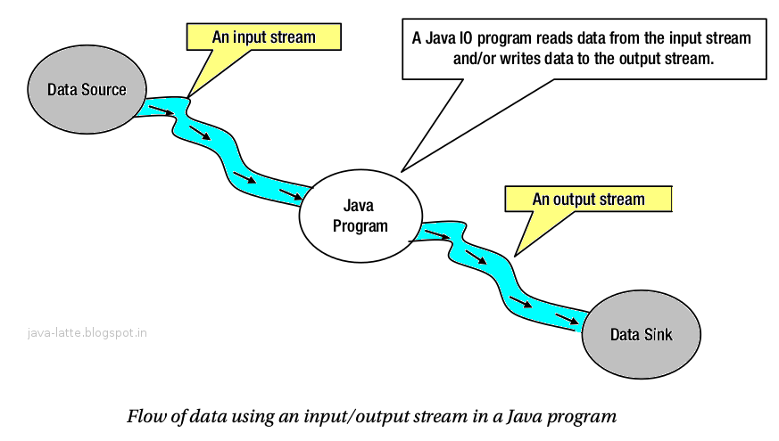
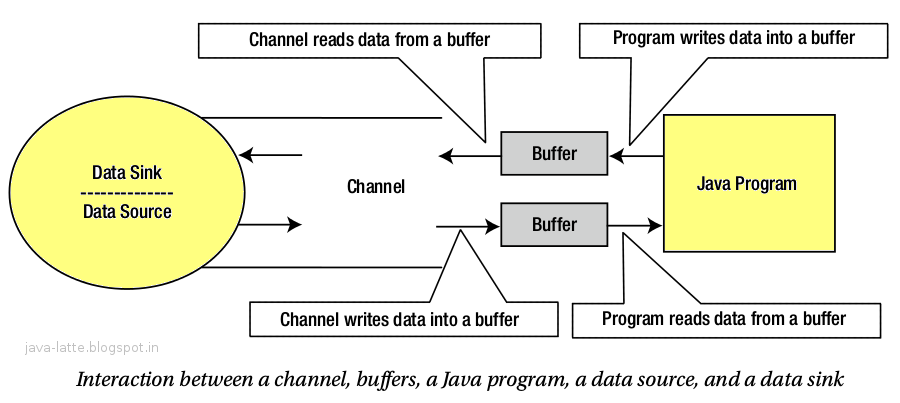

# IO AND NIO
Introduced in JDK 1.4, java.nio is buffer-oriented and supports non-blocking I/O. It provides a more efficient, low-level interface that is closer to the operating system's native I/O capabilities.
Java IO and NIO are two different APIs for handling input/output. 
- Java IO is the traditional stream-based blocking I/O model, 
- while Java NIO is a buffer- and channel- based I/O model that supports non-blocking operations and selectors.

## Java IO
The traditional java.io package is stream-oriented and blocking. When a Java application performs a read or write operation, the thread is blocked until the operation is complete.
java io introduced in 1.0. stream-based I/O uses streams to transfer data between a data source/sink and java program. 
The java program reads from or writes to a stream a byte at a time. This approach to performing I/O operations is slow. 

## Java NIO 
introduced in JAVA 1.4. In NIO, deal with channels and buffers for I/O operations. A channel is like a stream. 
It represents a connection between a data source/sink and a java program for data transfer.

There is one difference between a channel and a stream.

A stream can be used for one-way data transfer. That is, an input stream can only transfer data from a data source to a Java program; an output stream can only transfer data from a Java program to a data sink.
However, a channel provides a two-way data transfer facility.
You can use a channel to read data as well as to write data. You can obtain a read-only channel, a write-only channel, or a read-write channel depending on your needs.

## how to choose
| Scenario                            | Better choice | Why                          |
| ----------------------------------- | ------------- | ---------------------------- |
| Read/write normal files             | IO            | simpler                      |
| Read text line by line              | IO            | easy and readable            |
| Small utility program               | IO            | less complexity              |
| Few client socket connections       | IO            | enough and easier            |
| Thousands of concurrent connections | NIO           | scalable                     |
| Event-driven server                 | NIO           | selector model               |
| High-performance networking         | NIO           | non-blocking + channel model |
| Large file transfer optimization    | NIO           | `FileChannel`, transfer APIs |

